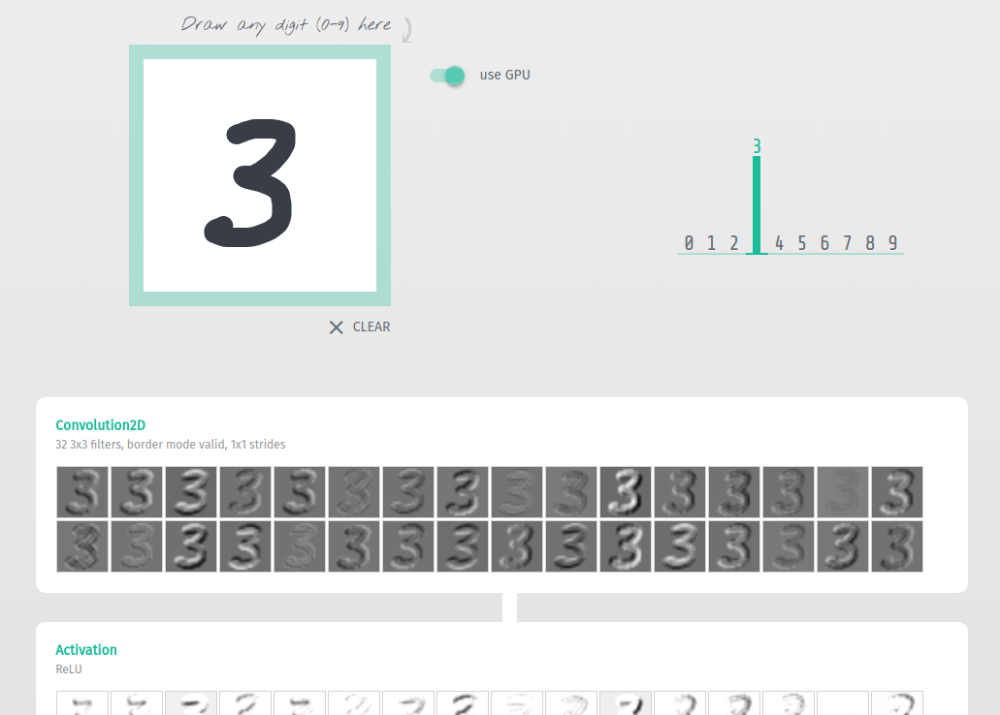
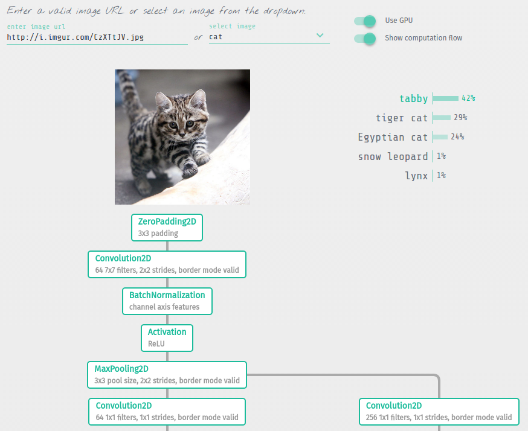
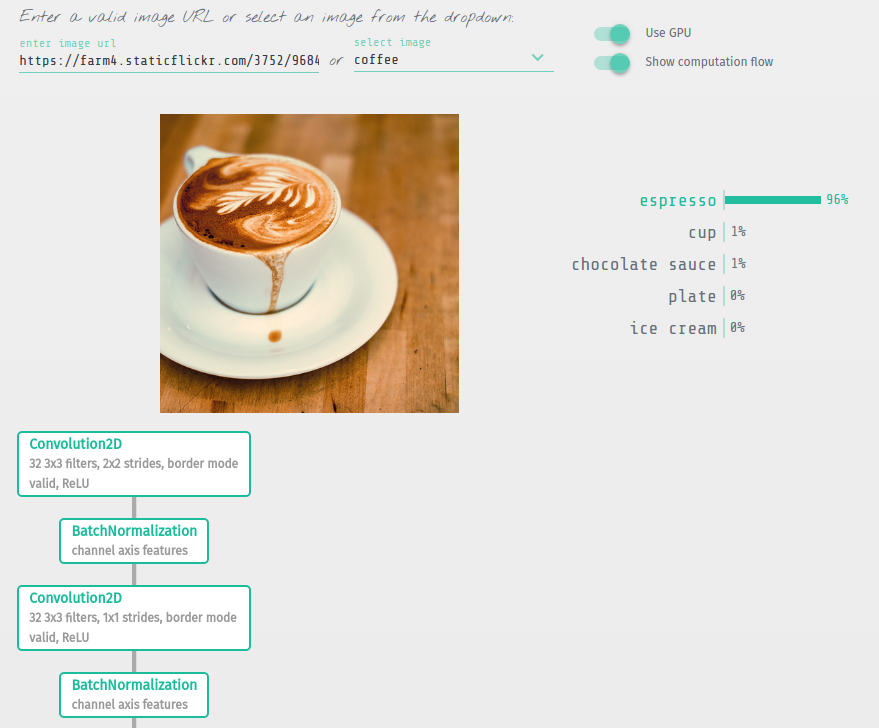
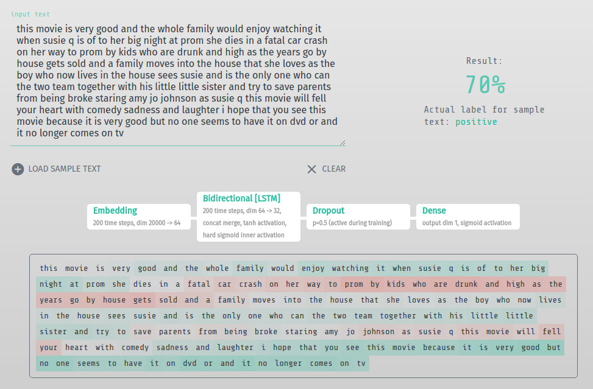

# [Keras.js](https://transcranial.github.io/keras-js)

Run [Keras](https://github.com/fchollet/keras) models (trained using Tensorflow backend) in your browser, with GPU support. Models are created directly from the Keras JSON-format configuration file, using weights serialized directly from the corresponding HDF5 file. Also works in node, but only in CPU mode.

Currently the focus of this library is on forward-pass inference only.

Tensor operations are extended on top of the [ndarray](https://github.com/scijs/ndarray) library. GPU support is powered by WebGL through [weblas](https://github.com/waylonflinn/weblas).

Library version compatibility:
- Keras 2.0.4
- TensorFlow 1.1.0

### [Interactive Demos](https://transcranial.github.io/keras-js)

<p align="center">
  <a href="https://transcranial.github.io/keras-js"></a>
  <a href="https://transcranial.github.io/keras-js"></a>
  <a href="https://transcranial.github.io/keras-js"></a>
  <a href="https://transcranial.github.io/keras-js"></a>
</p>

- Basic Convnet for MNIST

- Convolutional Variational Autoencoder, trained on MNIST

- Auxiliary Classifier Generative Adversarial Networks (AC-GAN) on MNIST

- 50-layer Residual Network, trained on ImageNet

- Inception v3, trained on ImageNet

- SqueezeNet v1.1, trained on ImageNet

- Bidirectional LSTM for IMDB sentiment classification

### Usage

See `demos/src/` for source code of real examples written in VueJS.

1. Works for models based on both `Model` and `Sequential` classes:

  ```py
  model = Sequential()
  model.add(...)
  ...
  ```

  ```py
  ...
  model = Model(input=..., output=...)
  ```

  Once trained, save the weights and export model architecture config:

  ```py
  model.save_weights('model.hdf5')
  with open('model.json', 'w') as f:
      f.write(model.to_json())
  ```

  See jupyter notebooks of demos for details: `demos/notebooks/`. All that's required for [ResNet50](https://github.com/fchollet/keras/blob/master/keras/applications/resnet50.py), for example, is:

  ```py
  from keras.applications import resnet50
  model = resnet50.ResNet50(include_top=True, weights='imagenet')
  model.save_weights('resnet50.hdf5')
  with open('resnet50.json', 'w') as f:
      f.write(model.to_json())
  ```

2. Run the encoder script on the HDF5 weights file:

  ```sh
  $ python encoder.py /path/to/model.hdf5
  ```

  This will produce 2 files in the same folder as the HDF5 weights: `model_weights.buf` and `model_metadata.json`.

3. The 3 files required for Keras.js are:

  - the model file: `model.json`

  - the weights file: `model_weights.buf`

  - the weights metadata file: `model_metadata.json`

4. Include Keras.js:

  ```html
  <script src="dist/keras.js"></script>
  ```

  or in node (4+ required):

  ```sh
  $ npm install keras-js --save
  # or
  $ yarn add keras-js
  ```

  ```js
  // namespaced
  const KerasJS = require('keras-js')
  // or
  import * as KerasJS from 'keras-js'

  // not namespaced
  const Model = require('keras-js').Model
  // or
  import { Model } from 'keras-js'
  ```

5. Create new model

  On instantiation, data is loaded using XHR (same-domain or CORS required), and layers are initialized as a directed acyclic graph:

  ```js
  // in browser, URLs can be relative or absolute
  const model = new KerasJS.Model({
    filepaths: {
      model: 'url/path/to/model.json',
      weights: 'url/path/to/model_weights.buf',
      metadata: 'url/path/to/model_metadata.json'
    },
    gpu: true
  })

  // in node, gpu flag will always be off
  // paths can be filesystem paths or absolute URLs
  // if filesystem path, this must be specified:
  const model = new KerasJS.Model({
    filepaths: {
      model: 'path/to/model.json',
      weights: 'path/to/model_weights.buf',
      metadata: 'path/to/model_metadata.json'
    },
    filesystem: true
  })
  ```

  Class method `ready()` returns a Promise which resolves when these steps are complete. Then, use `predict()` to run data through the model, which also returns a Promise:

  ```js
  model.ready()
    .then(() => {
      // input data object keyed by names of the input layers
      // or `input` for Sequential models
      // values are the flattened Float32Array data
      // (input tensor shapes are specified in the model config)
      const inputData = {
        'input_1': new Float32Array(data)
      }

      // make predictions
      return model.predict(inputData)
    })
    .then(outputData => {
      // outputData is an object keyed by names of the output layers
      // or `output` for Sequential models
      // e.g.,
      // outputData['fc1000']
    })
    .catch(err => {
      // handle error
    })
  ```

  Alternatively, we could also use async/await:

  ```js
  try {
    await model.ready()
    const inputData = {
      'input_1': new Float32Array(data)
    }
    const outputData = await model.predict(inputData)
  } catch (err) {
    // handle error
  }
  ```

### Available layers

  - *core*: Dense, Activation, Dropout, SpatialDropout1D, SpatialDropout2D, SpatialDropout3D, Flatten, Reshape, Permute, RepeatVector

  - *convolutional*: Conv1D, Conv2D, SeparableConv2D, Conv2DTranspose, Conv3D, Cropping1D, Cropping2D, Cropping3D, UpSampling1D, UpSampling2D, UpSampling3D, ZeroPadding1D, ZeroPadding2D, ZeroPadding3D

  - *pooling*: MaxPooling1D, MaxPooling2D, MaxPooling3D, AveragePooling1D, AveragePooling2D, AveragePooling3D, GlobalMaxPooling1D, GlobalMaxPooling2D, GlobalMaxPooling3D, GlobalAveragePooling1D, GlobalAveragePooling2D, GlobalAveragePooling3D

  - *recurrent*: SimpleRNN, LSTM, GRU

  - *embeddings*: Embedding

  - *merge*: Add, Multiply, Average, Maximum, Concatenate, Dot

  - *advanced activations*: LeakyReLU, PReLU, ELU, ThresholdedReLU

  - *normalization*: BatchNormalization

  - *noise*: GaussianNoise, GaussianDropout

  - *wrappers*: Bidirectional, TimeDistributed

  - *legacy*: Merge, MaxoutDense, Highway

### Layers to be implemented

  - *core*: Lambda

  - *local*: LocallyConnected1D, LocallyConnected2D

### Notes

**WebWorkers and their limitations**

Keras.js can be run in a WebWorker separate from the main thread. Because Keras.js performs a lot of synchronous computations, this can prevent the UI from being affected. However, one of the biggest limitations of WebWorkers is the lack of `<canvas>` (and thus WebGL) access. So the benefits gained by running Keras.js in a separate thread are offset by the necessity of running it in CPU-mode only. In other words, one can run Keras.js in GPU mode only on the main thread. [This will not be the case forever.](https://github.com/whatwg/html/pull/1876)

**WebGL MAX_TEXTURE_SIZE**

In GPU mode, tensor objects are encoded as WebGL textures prior to computations. The size of these tensors are limited by `gl.getParameter(gl.MAX_TEXTURE_SIZE)`, which differs by hardware/platform. See [here](http://webglstats.com/) for typical expected values. For operations involving tensors where this value is exceeded along any dimension, that operation falls back to the CPU.

Firefox on certain platforms (macOS in particular, possibly others) still has texture size limits hard-coded. Even on modern GPUs, this limit may be too low. This is a [known issue](https://bugzilla.mozilla.org/show_bug.cgi?id=986871). While Keras.js will gracefully downgrade to use the CPU in this case, computational performance will be degraded. One way to get around this is to go to `about:config` and change `gfx.work-around-driver-bugs` to `false`, and restart the browser. This should increase the max texture size back to normal.

### Development / Testing

There are extensive tests for each implemented layer. See `notebooks/` for jupyter notebooks generating the data for all these tests.

```sh
$ npm install
# or
$ yarn
```

To run all tests run `npm run server` and simply go to [http://localhost:3000/test/](http://localhost:3000/test/). All tests will automatically run. Open up your browser devtools for additional test data info.

For development, run:

```sh
$ npm run watch
```

Editing of any file in `src/` will trigger webpack to update `dist/keras.js`.

To create a production UMD webpack build, output to `dist/keras.js`:

```sh
$ npm run build:browser
```

Data files for the demos are located at `demos/data/`. Due to its large size, this folder is ignored by git. Clone the [keras-js-demos-data](https://github.com/transcranial/keras-js-demos-data) repo and copy the contents to `demos/data/`.

### License

[MIT](https://github.com/transcranial/keras-js/blob/master/LICENSE)
